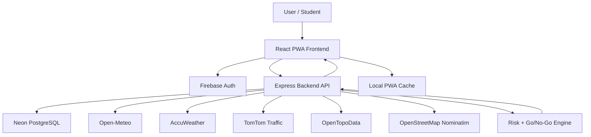

# SkyCheck Documentation

## 1. Project Overview

SkyCheck is a student commute decision-support system. It helps users decide whether they should go to school, proceed with caution, or avoid travel based on real-world conditions.

The system does not only show weather. It combines several commuter risk factors:

- Weather condition
- Rain probability
- Heat index
- Traffic condition
- Flood risk
- Saved route information
- School announcements
- Government advisories
- User health status

The final output is a Go / No-Go decision:

- `GO` - conditions are generally safe
- `OWN_RISK` - user may proceed, but caution is needed
- `DO_NOT_GO` - travel is unsafe or unnecessary

## 2. Problem Solved

Students often decide whether to go to school using incomplete information. Weather apps may show rain but not commute risk. Traffic apps may show road speed but not health or class status. School announcements may be separate from weather warnings.

SkyCheck solves this by bringing those factors into one mobile-first app.

The problem areas addressed are:

- Sudden rain affecting student commuters
- Flood-prone routes
- Heat index and health risk
- Traffic delays
- Lack of one place for commute-related decisions
- Low-connectivity situations where users still need their last known data

## 3. Target Users

Primary users:

- Gordon College students
- Student commuters in Olongapo, Subic, and nearby areas
- Users who depend on walking, public transport, motorcycles, or ride-hailing

Secondary users:

- School offices that post class status
- Students with health concerns
- Parents or guardians checking commute risk

## 4. Unique Value Proposition

SkyCheck is unique because it is not just a weather app. It is a context-aware student commute assistant.

Its unique value is the combination of:

- Weather risk
- Traffic risk
- Flood risk
- Heat index
- User health check
- Class status
- Government advisories
- Saved route monitoring
- Offline cached decision support

Instead of asking "What is the weather?", SkyCheck answers: **"Should I go to school today?"**

## 5. System Architecture



## 6. Frontend Architecture

The frontend is located in `skycheck/`.

Main frontend responsibilities:

- User interface
- Firebase login/signup/forgot password
- Storing JWT session from the backend
- Fetching dashboard, routes, health, alerts, and Go / No-Go results
- Persisting selected query data for offline mode
- Registering the PWA service worker
- Showing responsive layouts for mobile and desktop
- Requesting GPS access and applying the Subic fallback when precise location is unavailable

Important frontend tools:

- React for UI
- Vite for build tooling
- Tailwind CSS for styling
- TanStack Query for API state and caching
- TanStack Query persister for local cache persistence
- Zustand for lightweight app state
- Firebase SDK for authentication
- Leaflet for maps

## 7. Backend Architecture

The backend is located in `skycheck-backend/`.

Main backend responsibilities:

- REST API
- Firebase token verification
- JWT session issuing
- User, route, alert, and health data storage
- Weather aggregation
- Traffic lookup
- Flood risk lookup
- Go / No-Go evaluation
- Scheduled risk checks for saved routes

Important backend tools:

- Express for API routing
- Prisma for database access
- PostgreSQL / Neon for persistence
- Firebase Admin SDK for verifying Firebase ID tokens
- JSON Web Tokens for app session tokens
- Node Cron for scheduled checks

## 8. Authentication Flow

SkyCheck uses Firebase Authentication for the identity layer.

Supported sign-in methods:

- Email and password
- Google sign-in
- Password reset through Firebase
- Email verification for manual signup

Flow:

1. User signs in through Firebase.
2. Firebase returns an ID token.
3. Frontend sends the Firebase ID token to the backend.
4. Backend verifies the token using Firebase Admin SDK.
5. Backend finds or creates the user in PostgreSQL.
6. Backend returns a SkyCheck JWT.
7. Frontend uses the JWT for protected API requests.

This keeps authentication secure while still allowing SkyCheck to store its own user-specific data.

## 9. Weather System

SkyCheck primarily uses Open-Meteo for weather data.

Collected weather variables include:

- Temperature
- Apparent temperature / feels-like
- Humidity
- Rain probability
- Precipitation
- Wind speed
- Wind gust
- Weather code
- Hourly forecast
- 15-minute precipitation signals

AccuWeather is used as an optional enhancer and fallback.

Weather behavior:

- Open-Meteo is used first.
- AccuWeather can improve current conditions and hourly probability.
- If Open-Meteo fails or is rate-limited, AccuWeather can be used as fallback.
- If AccuWeather quota/key fails, the app falls back to Open-Meteo when available.
- Weather is cached server-side to reduce API usage.

### Location behavior for weather

The Dashboard first asks the user to grant GPS access.

If precise GPS succeeds:

- Weather is fetched for the user's current coordinates.
- The dashboard shows the geocoded place name.
- A `Live +/-Xm` badge communicates the browser-reported accuracy.

If precise GPS fails, is blocked, unsupported, or too imprecise:

- SkyCheck automatically uses the fallback area: `Subic, Zambales, Central Luzon, PH`.
- Fallback coordinates are `14.8799, 120.2343`.
- The Home screen location label changes to `Subic, Zambales, Central Luzon, PH`.
- Weather and risk information are fetched for the fallback coordinates.
- The user is notified that precise location was unavailable and that mobile GPS is recommended for better accuracy.

This keeps the app useful on PC/laptop devices where browsers may only provide rough Wi-Fi/IP-based location.

## 10. Traffic System

SkyCheck uses TomTom Traffic Flow API when available.

TomTom behavior:

- Dashboard traffic uses the user's current GPS coordinates.
- Saved route traffic uses the route's starting coordinates.
- TomTom returns current road speed and free-flow speed.
- The backend converts that into a congestion ratio.

If TomTom is unavailable, missing, or rate-limited, SkyCheck uses a Philippine rush-hour heuristic.

The fallback estimates traffic based on:

- Morning rush hour
- Lunch rush
- Evening rush hour
- Weekend vs weekday behavior
- Local commute patterns

This means traffic does not become useless when the traffic API fails.

## 11. Flood Risk System

Flood risk is estimated using:

- Elevation
- Rain probability
- Recent precipitation
- Route start and destination points

The backend checks route flood risk by evaluating both endpoints and using the worse condition.

Flood risk categories:

- `LOW`
- `MEDIUM`
- `HIGH`
- `UNKNOWN`

`UNKNOWN` is used when the elevation service is unavailable.

## 12. Route System

Users can save routes with:

- Start address
- Destination address
- Coordinates
- Departure time
- Distance
- Duration
- Fare estimate
- Last known route risk

Route risk includes:

- Weather
- Traffic
- Flood
- Overall risk
- Risk basis explanation

Saved routes are refreshed by the backend and cached on the frontend. Offline mode can show the last cached saved routes, but adding, editing, and deleting routes require internet.

The route preview map uses Leaflet with MapTiler street tiles when a key is configured, otherwise it falls back to OpenStreetMap tiles. The map now zooms closer for route endpoints so nearby streets and barangay-level detail are easier to inspect.

## 13. Go / No-Go Engine

The Go / No-Go engine combines multiple factors into one decision.

Inputs:

- Weather risk
- Flood risk
- Traffic risk
- Heat index
- Rain probability
- Wind speed
- Health check answers
- School status
- Government advisory severity

Outputs:

- Verdict
- Primary reason
- Safety score
- Recommendation
- Full assessment breakdown

Decision categories:

- `GO`
- `OWN_RISK`
- `DO_NOT_GO`

Example logic:

- Severe illness can produce `DO_NOT_GO`.
- High weather risk can produce `OWN_RISK`.
- Combined severe weather and flood risk can produce `DO_NOT_GO`.
- Online or suspended class status can affect the final decision.

## 14. Health Check

The health check asks about:

- Overall feeling
- Fever
- Cough
- Sore throat
- Fatigue
- Difficulty breathing
- Headache
- Body pain
- Vomiting or nausea
- Chronic conditions
- Additional notes

The health check is used by the Go / No-Go engine because commute safety is not only environmental. A user with fever, breathing difficulty, or severe symptoms should not be advised the same way as a healthy user.

## 15. Offline / PWA Functionality

SkyCheck is installable as a PWA and supports offline access through cached data.

Offline mode supports:

- Last cached weather dashboard
- Last cached route list
- Local health check for today
- Offline Go / No-Go estimate based on cached weather/risk data

Offline mode does not support:

- Adding routes
- Editing routes
- Deleting routes
- Searching new addresses
- Fetching new weather
- Fetching new traffic
- Fetching new flood data
- Fetching new advisories

Offline Go / No-Go behavior:

1. User opens Dashboard while online at least once.
2. Weather and risk data are cached.
3. If the user goes offline, they can open Health Check.
4. The offline health check is stored locally.
5. Go / No-Go uses cached weather and local health data to produce an offline estimate.

The app clearly labels the result as an offline estimate.

## 16. Database Models

Main Prisma models:

- `User`
- `Route`
- `Alert`
- `HealthCheck`
- `SchoolAnnouncement`
- `GovAnnouncement`

The database stores account records, saved routes, health checks, route risk snapshots, and announcements.

## 17. API Summary

Main API areas:

- `/auth` - authentication and Firebase session exchange
- `/weather` - current weather, hourly forecast, risk, and tips
- `/routes` - saved routes and route risk
- `/alerts` - weather/traffic/flood alerts
- `/health/today` - today's health check
- `/health/check` - submit health check
- `/health/evaluate` - Go / No-Go evaluation
- `/announcements` - school and government announcements

## 18. Environment Variables

### Frontend

```env
VITE_API_BASE_URL=
VITE_FIREBASE_API_KEY=
VITE_FIREBASE_AUTH_DOMAIN=
VITE_FIREBASE_PROJECT_ID=
VITE_FIREBASE_APP_ID=
VITE_FIREBASE_STORAGE_BUCKET=
VITE_FIREBASE_MESSAGING_SENDER_ID=
VITE_MAPTILER_KEY=
```

### Backend

```env
DATABASE_URL=
JWT_SECRET=
NODE_ENV=
PORT=
FRONTEND_URL=
FIREBASE_PROJECT_ID=
FIREBASE_CLIENT_EMAIL=
FIREBASE_PRIVATE_KEY=
EMAIL_USER=
EMAIL_PASS=
ORS_API_KEY=
TOMTOM_API_KEY=
ACCUWEATHER_API_KEY=
```

## 19. Deployment Notes

Frontend is deployed on Vercel.

Recommended settings:

- Root directory: `skycheck`
- Build command: `npm run build`
- Output directory: `dist`

Backend is deployed on Render.

Recommended settings:

- Root directory: `skycheck-backend`
- Build command: `npm install --include=dev && npm run build`
- Start command: `npm start`

Firebase Authentication authorized domains must include the deployed Vercel domain.

## 20. Accuracy Notes

SkyCheck is intended as a commute decision-support tool, not an official weather agency replacement.

Accuracy is improved by:

- Combining Open-Meteo and AccuWeather
- Using 15-minute precipitation signals when available
- Calibrating rain probability with precipitation and weather codes
- Using heat index instead of temperature alone
- Adding traffic and flood context
- Showing fallback estimates when live APIs fail
- Using live GPS coordinates when available, with automatic Subic fallback when precise location cannot be trusted

The app should be presented as a support tool that helps students make safer decisions, not as an absolute guarantee.

Location accuracy depends on the device:

- Mobile phones are usually more accurate because they have GPS hardware.
- PC/laptop browsers may use Wi-Fi/IP estimates, which can be rough or unavailable.
- When the app cannot obtain precise coordinates, it avoids showing a fake exact location and clearly switches to the Subic fallback area.

## 21. Presentation Questions and Answers

### Does this use emerging technology?

Yes. It uses a Progressive Web App design, real-time API integration, location-based risk analysis, Firebase authentication, and a decision engine that combines multiple live and cached data sources.

### What problem does it solve?

It helps students decide whether it is safe and practical to commute to school by combining weather, traffic, flood, health, and announcement data.

### Who are the target users?

The target users are student commuters, especially Gordon College students and nearby commuters affected by rain, heat, traffic, and flooding.

### What technologies were used?

React, Vite, TypeScript, Tailwind CSS, Firebase Auth, Node.js, Express, Prisma, PostgreSQL, Open-Meteo, AccuWeather, TomTom, OpenTopoData, Vercel, and Render.

### How does offline mode work?

The PWA stores selected data locally. When offline, it can show cached weather and saved routes. It can also create an offline Go / No-Go estimate using cached weather and a local health check.

### Is the app unique?

Yes. Many apps show weather or traffic separately. SkyCheck combines those with health checks, route risk, flood risk, school status, and offline support to answer a student-specific question: should I go to school today?

### How accurate is it?

It is more accurate than relying on one simple weather reading because it combines multiple factors. However, it should still be treated as a decision-support tool, not an official emergency warning system.

### What happens if GPS fails?

The app automatically uses `Subic, Zambales, Central Luzon, PH` as a fallback location, fetches weather and risk data for that area, and notifies the user that mobile GPS is recommended for better accuracy.

## 22. Future Improvements

Possible future improvements:

- Push notifications for worsening route risk
- Admin dashboard for school announcements
- More precise flood mapping
- More route waypoints for traffic and flood checking
- Historical commute risk analytics
- Better offline syncing for health checks
- Support for more campuses
